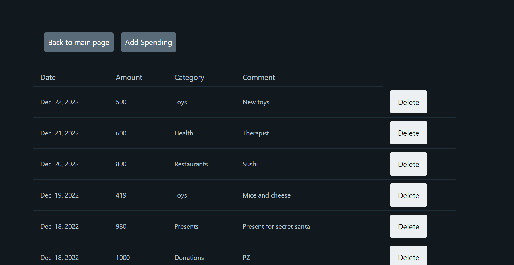
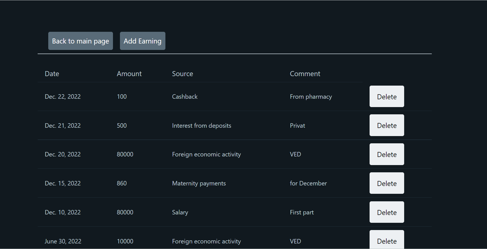
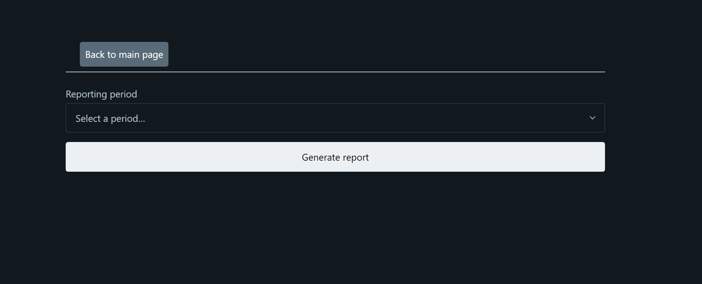
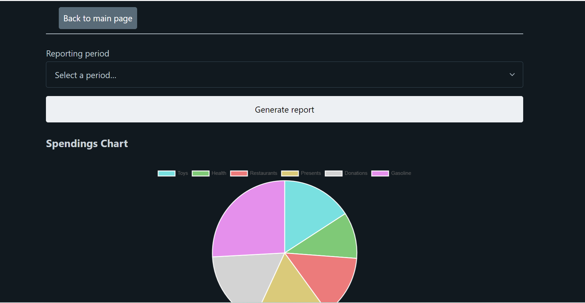
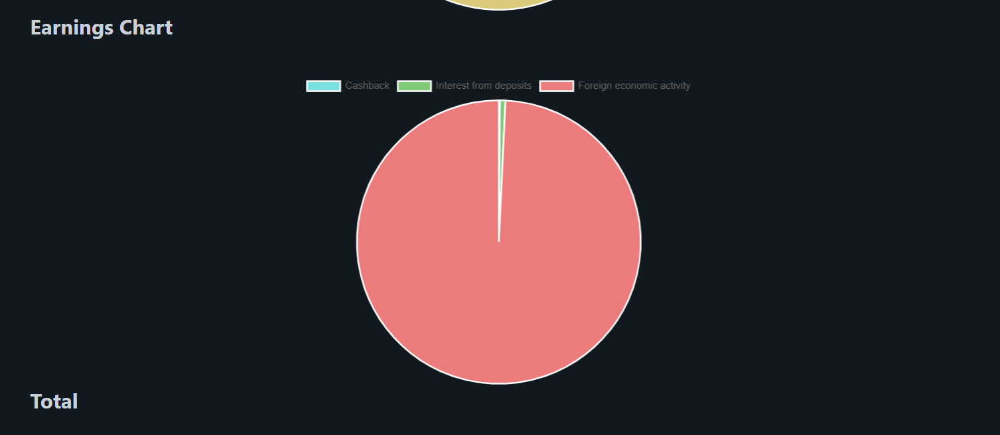
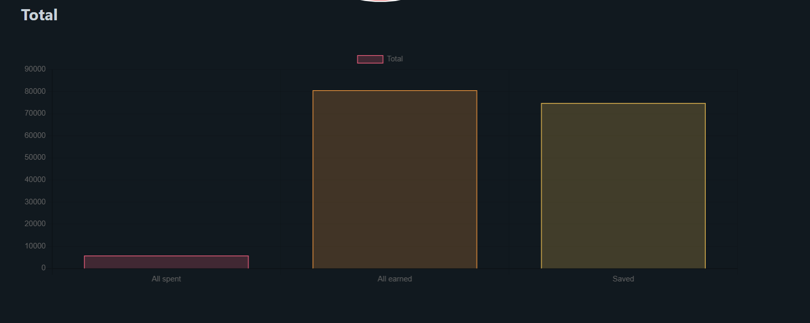

# ledger-django

This is a simple ledger that can help you manage finances.

It supports adding spendings and earnings, automatically orders them by date, and generates charts of spendings by 
categories, earnings by source and general overview of your financial situation.

Here is how it looks:

